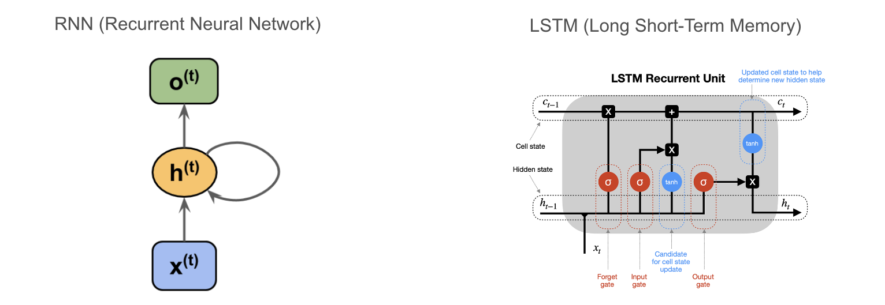
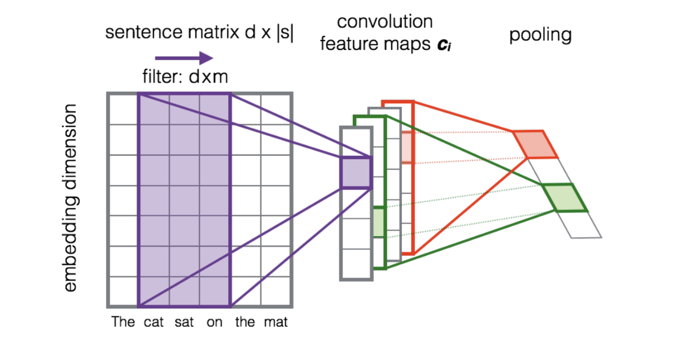

# NLP - News Topic Identification
-- Yuanshan Zhang, Mengxin Zhao, Yahui Wen, Yiming Wang, Jiayun Liu

## What I did
**1. NLP**\
In this project, I applied text mining techniques to the AG news corpus to classify the news based on their categories. First, I cleaned up and converted the txt file into csv format. Second, I randomly sampled 5000 data points from 4 categories:  'Business', 'Entertainment', 'Sports', 'Sci/Tech', and split the sampled data into a train set and test set. Then, I preprocessed the text data by using regular expressions, tokenizing , removing stop words, and lemmatizing. 

After preprocessing, I applied vectorization and embedding to preprocessed documents. For vectorization, I used BoW (Bag of Words) and TF-IDF (Term Frequency - Inverse Document Frequency). For embedding, I trained a Word2Vec model and loaded a pre-trained GloVe model("glove-wiki-gigaword-100") and calculated their average, TF-IDF weighted average, and IDF-weighted average. 

**2. Supervised ML**\
After vectorizing and embedding, I compared the performance of BoW, TF-IDF, Word2Vec, and GloVe using Random Forest. 

Finally, I chose the most promising embedding method (i.e. GloVe) and used deep learning to enhance its performance. Moreover, I built several different deep-learning models for further investigation. 

**3. Deep Learning**\
The fundamental technique that lies under today’s Large Language Models is the Recurrent Neural Network. However, it is hard for RNN to keep track of early information due to gradient exploding/vanishing issues that usually happen when the sequence length, or equivalently, the time step is greater than 100. LSTM, on the other hand, partially fixes this problem by using gate control. To investigate these two models, I built two LSTMs (one with pre-train GloVe as its embedding and one with an embedding layer) and one RNN. 

The data preparation procedures are as follows:
1. Embed each token into a fixed-size vector (n_dim << n_tokens)\
‘I’ → [0.2, 0.1], ‘am’ → [0.8, 0.63], ‘batman’ → [0.33, 0.99]

3. For each document, arrange vectors to form sequences\
[‘I’, ‘am’, ‘batman’] → [[0.2, 0.1], [0.8, 0.63], [0.33, 0.99]]

4. Pad sequences so that all documents have the same length\
[[0.2, 0.1], [0.8, 0.63], [0.33, 0.99]] → [[0.2, 0.1], [0.8, 0.63], [0.33, 0.99], [0, 0], [0, 0]]

5. One-hot encode the target\
[‘Business’, ‘Entertainment’, ‘Sci/Tech’, ‘Sports’] → [[1,0,0,0], [0,1,0,0], [0,0,1,0], [0,0,0,1]]

Further, the convolutional technique has proven its efficiency in combining with LSTM and RNN for feature extraction and dimensionality reduction. So before I passed the document matrix to the hidden layer of the LSTM and RNN, I used the convolutional and max pooling layer to perform feature extraction, reducing time steps from 180 to 44 and embedding dimension from 100 to 80.

## Conclusions
* On the one hand, vectorization methods such as BoW and TF-IDF give descent accuracy when applied to traditional ML models such as random forest (the test accuracies for BoW and TF-IDF are both 0.78). However, they are inevitably subject to the curse of dimensionality (dimension of features = the number of unique tokens of the entire dataset, which is 34626). As a result, the number of dimensions exceeds the number of training samples, leading to overfitting and exhausting computation.
* On the other hand, embedding methods such as Word2Vec and GloVe are more elegant ways to achieve similar or even better performance. Moreover, I observed that the average and TF-IDF/IDF weighted average of word embeddings are similarly effective in achieving a document-level vector representation. For Word2Vec, taking the average and IDF weighted average of its embedding both gives test accuracies of 0.72 and taking the TF-IDF weighted average gives a test accuracy of 0.73. Therefore, in our project, It is sufficient to use the average of word embedding.
* Pre-trained GolVe significantly improves the test accuracy to 0.8. In practice, using a pre-trained word embedding (transfer learning) provides the model with an important language understanding basis that will significantly improve the model's performance, especially when the data is small.
* LSTM with pre-trained GloVe embedding gives the highest test accuracy (0.83). One advantage of deep learning models over traditional methods is that sequential input allows them to learn the context.
* Simple RNN and LSTM without pre-trained embeddings tend to overfit, be less accurate, and take longer to converge. Therefore, without a large dataset, using pre-trained embedding is an excellent choice for deep learning in that it makes deep learning models converge faster, and more accurate, and increases their generalizing abilities on unseen data
